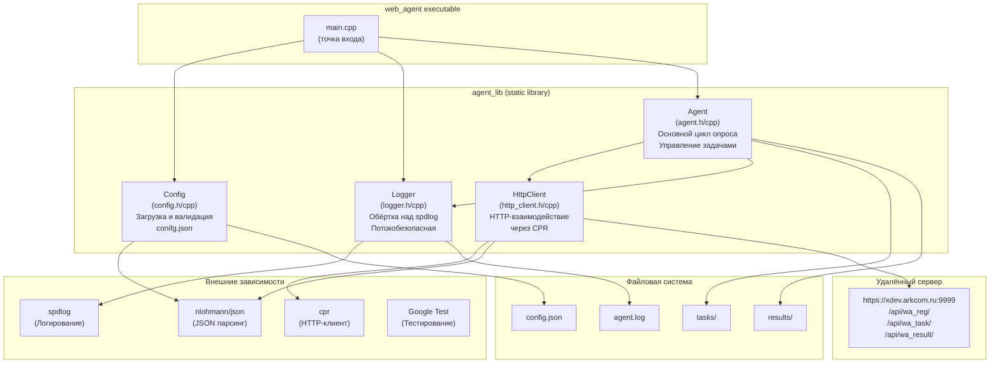
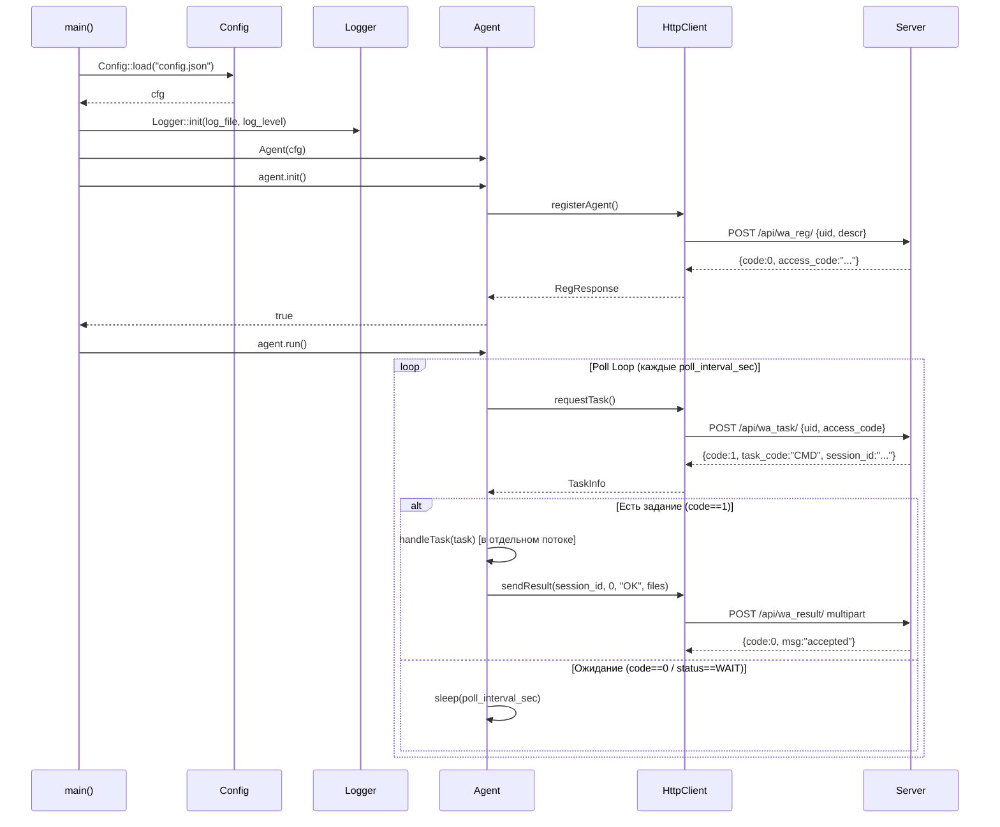

# Черновик архитектуры WEB-AGENT

**Статус:** Черновик (ЛР №1)
**Версия:** 0.1

---

## Обзор

WEB-AGENT — однопроцессный многопоточный фоновый агент. Основной поток занимается циклом опроса сервера, задания выполняются в пуле потоков. Весь доступ к сети централизован в `HttpClient`, конфигурация неизменна после загрузки, логирование потокобезопасно.

Архитектура намеренно плоская: 4 модуля без глубокой иерархии наследования. Цель — простота и тестируемость.

---

## Диаграмма компонентов



---

## Модули

| Модуль | Файлы | Назначение | Статус (ЛР №1) |
|---|---|---|---|
| Config | `include/config.h`, `src/config.cpp` | Загрузка и валидация конфигурации из JSON | Реализован |
| Logger | `include/logger.h`, `src/logger.cpp` | Потокобезопасное логирование (spdlog) | Реализован |
| HttpClient | `include/http_client.h`, `src/http_client.cpp` | HTTP-запросы к API сервера (cpr) | Заглушка |
| Agent | `include/agent.h`, `src/agent.cpp` | Цикл опроса, управление заданиями | Заглушка |
| main | `src/main.cpp` | Точка входа, разбор аргументов | Рабочий |

---

## Планируемый поток выполнения



---

## Зависимости

| Библиотека | Версия | Лицензия | Назначение | Подключение |
|---|---|---|---|---|
| nlohmann/json | 3.11.3 | MIT | JSON сериализация/десериализация | FetchContent |
| spdlog | 1.13.0 | MIT | Высокопроизводительное логирование | FetchContent |
| cpr | 1.10.5 | MIT | HTTP-клиент (обёртка над libcurl) | FetchContent |
| Google Test | 1.14.0 | BSD-3 | Unit/интеграционное тестирование | FetchContent |

---

## Структура потоков

```
Процесс web_agent
├── Главный поток
│   ├── Config::load()
│   ├── Logger::init()
│   ├── Agent::init() → HTTP registerAgent
│   └── Agent::run() → запускает poll_thread
├── poll_thread (Agent::pollLoop)
│   ├── HTTP requestTask() → ждёт задание
│   └── При получении задания → запускает task_thread
└── task_thread[0..N] (Agent::handleTask) — макс. max_parallel_tasks
    ├── Запуск процесса / выполнение команды
    ├── Ожидание завершения
    └── HTTP sendResult() → отправляет результат
```

---

## TODO для ЛР №2

- [ ] Реализовать `HttpClient::registerAgent()` через cpr (POST + JSON)
- [ ] Реализовать `HttpClient::requestTask()` через cpr
- [ ] Реализовать `HttpClient::sendResult()` с multipart/form-data
- [ ] Добавить retry-логику с exponential backoff в HttpClient
- [ ] Добавить таймауты (connect 5с, request 10с, upload 30с)
- [ ] Реализовать `Agent::pollLoop()` с sleep и graceful shutdown
- [ ] Реализовать `Agent::handleTask()` для типов CMD и EXEC
- [ ] Добавить пул потоков с лимитом `max_parallel_tasks`
- [ ] Добавить обработку сигналов SIGINT/SIGTERM
- [ ] Написать unit-тесты для HttpClient (mock-сервер)
- [ ] Написать интеграционные тесты (регистрация на реальном сервере)
